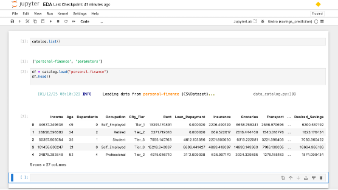
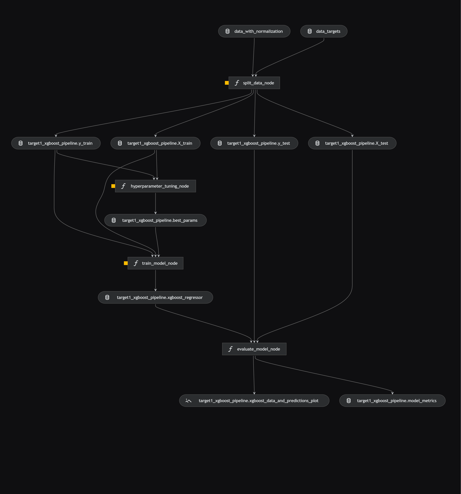

# savings prediction

[](https://kedro.org)

## Overview
This ML project is solution of kaggle project (https://www.kaggle.com/datasets/mehransaifi/indian-personal-finance-and-spending).
Solution is basically implemented as Kedro project with Kedro-Viz, which was generated using `kedro 0.19.10`.

Take a look at the [Kedro documentation](https://docs.kedro.org) to get started.

## How the project configured

We followed below steps to set up the project:
*(Chose the suitable local drive location)*
  
  * **Creating the kedro project**

```commandline
python -m venv venv                 --create virtual enviornment
source venv/bin/activate            --activate enviornment
git config –list                    --check git setup
kedro info                          --validate if kedro is there
pip install kedro                   --install kedro
kedro info                          --validate now kedro is there
kedro new
	name – savings prediction   --it creates project folder structure
cd savings-prediction
```
* **Applying the dependencies**

  Edit requirements.txt to add following dependencies
  * matplotlib
  * seaborn
  * xgboost
  * lightgbm
```commandline
pip install -r requirements.txt

```
* **Proving data to kedro**

Manually download the data from kaggle source and copy to folder data/01_raw.
Define new entry into catalog.yml as


```commandline
kedro run --run in terminal
```
* **Going to Jupyter from kedro**
```commandline
kedro jupyter notebook --run in separate terminal
```
Jupyter notebook on browser with loading the dataset using catalog


* **Pushing everything to GitHub**

Lets push the initial code to git, for this we have create repository in our git account
```commandline
git init
git add .
commit -m "Initial kedro setup"
git branch -M main
git remote add origin https://github.com/bahadurvikram/personal-finance.git
git remote -v
git push -u origin main

```
* 
  * Make sure your results can be reproduced by following a [data engineering convention](https://docs.kedro.org/en/stable/faq/faq.html#what-is-data-engineering-convention)
  * Don't commit data to your repository
  * Don't commit any credentials or your local configuration to your repository. Keep all your credentials and local configuration in `conf/local/`


## Problem statement
Dataset contains detailed financial and demographic data for 20,000 individuals, focusing on income, expenses, and potential savings across various categories. The data aims to provide insights into personal financial management and spending patterns.
Our object is to predict the different savings as targets using regression analysis.
* **Income & Demographics**:
  * Income: Monthly income in currency units.
  * Age: Age of the individual.
  * Dependents: Number of dependents supported by the individual.
  * Occupation: Type of employment or job role.
  * City_Tier: A categorical variable representing the living area tier (e.g., Tier 1, Tier 2).
* **Monthly Expenses**:
  * Categories like Rent, Loan_Repayment, Insurance, Groceries, Transport, Eating_Out, Entertainment, Utilities, Healthcare, Education, and Miscellaneous record various monthly expenses.
* **Financial Goals & Savings**:
  * Desired_Savings_Percentage and Desired_Savings: Targets for monthly savings.
  * Disposable_Income: Income remaining after all expenses are accounted for.
* **Potential Savings: (targets)**
  * Includes estimates of potential savings across different spending areas such as Groceries, Transport, Eating_Out, Entertainment, Utilities, Healthcare, Education, and Miscellaneous.


## Performing EDA
We performed the EDA to understand the features and their relationships
[EDA Reference](https://github.com/bahadurvikram/personal-finance/blob/main/notebooks/EDA.ipynb)

## Defining kedro pipelines
```commandline
kedro pipeline create dataprocessing
```


```commandline
kedro pipeline create linear_regression
```


```commandline
kedro pipeline create xgboost_regression
```


```commandline
kedro pipeline create lgbm_regression
```


## Important kedro commands
```commandline
kedro run
kedro run --pipeline <pipeline name>
kedro ipython
%load_ext kedro.ipython
%reload_ext kedro.ipython
kedro pipeline create <pipeline name>
kedro registry list
kedro viz run
kedro run --no-telemetry
kedro catalog rank
kedro catalog resolve
kedro  viz --pipeline <pipelinename> --port 4146
```
## Results
Comparing models performances for one of target variable ***Potential_Savings_Groceries***

| Model Name             | Score Result                                            | Test Data Comparison                                              |
|------------------------|---------------------------------------------------------|-------------------------------------------------------------------|
| ***LinearRegression*** | [CSV file here](results/linear_model_metrics_target1.csv) |   |
| ***XGBoost***          | [CSV file here](results/xgboost_model_metrics_target1.csv) |  |
| ***LightGBM***         | [CSV file here](results/lgbm_model_metrics_target1.csv) |     |

It seems none of applied advance models enhance the prediction, its mostly because available data is very linearly attributed with target variable.  

## Few observations about kedro
* Namespaces are nice feature to scope pipeline parameters parametrized or non-parameterized.
* Pipeline wrapper instantiate allows multiple instances of pipelines with static structure, with dynamic inputs/outputs/parameters.
* Dynamic datasets in out case help to reduce number of statements in catalog.yml
* Saving datasets in csv does not work well to preserve the data types, bette to use pickle.
* If kedro does not find pipeline during run --pipeline, most probably there is python coding errors in node.py or pipeline.py and sum time inputs and outputs count mismatch
* At present there is no way to rename the existing pipeline
* Pipeline can be deleted using kedro command
* Sometimes during kedro viz ports are in use, we can define any free port via --port <portnumber>

## Remaining items
* Unit testing to test the integrity of nodes and pipeline.
* Integration tests to validate the flow of data in pipeline.
