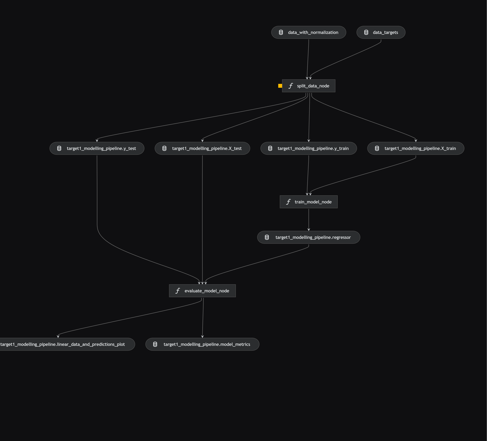

# savings prediction

[](https://kedro.org)

## Overview
This ML project is solution of kaggle project (https://www.kaggle.com/datasets/mehransaifi/indian-personal-finance-and-spending).
Solution is basically implemented as Kedro project with Kedro-Viz, which was generated using `kedro 0.19.10`.

Take a look at the [Kedro documentation](https://docs.kedro.org) to get started.

## How the project configured

We followed steps to set up the project:

* Chose the local drive location and followed
```commandline
python -m venv venv --create virtual enviornment
source venv/bin/activate --activate enviornment
git config –list --check git setup
kedro info # validate if kedro is there
pip install kedro --install kedro
kedro info -- validate now kedro is there
kedro new
	name – savings prediction --it creates project folder structure
cd savings-prediction
```

Edit requiremnts.txt to add
* matplotlib
* seaborn
* xgboost
* lightgbm
```commandline
pip install -r requirements.txt

```

Manually download the data from kaggle source and copy to folder data/01_raw.
Define new entry into catalog.yml as


```commandline
kedro run --run in terminal
kedro jupyter notebook --run in separate terminal
```
Jupyter notebook on browser with loading the dataset using catalog


Lets push the initial code to git, for this we have create repository in our git account
```commandline
git init
git add .
commit -m "Initial kedro setup"
git branch -M main
git remote add origin https://github.com/bahadurvikram/personal-finance.git
git remote -v
git push -u origin main

```

* Make sure your results can be reproduced by following a [data engineering convention](https://docs.kedro.org/en/stable/faq/faq.html#what-is-data-engineering-convention)
* Don't commit data to your repository
* Don't commit any credentials or your local configuration to your repository. Keep all your credentials and local configuration in `conf/local/`

## Problem statement
Dataset contains detailed financial and demographic data for 20,000 individuals, focusing on income, expenses, and potential savings across various categories. The data aims to provide insights into personal financial management and spending patterns.
Our object is to predict the different savings as targets using regression analysis.
* **Income & Demographics**:
  * Income: Monthly income in currency units.
  * Age: Age of the individual.
  * Dependents: Number of dependents supported by the individual.
  * Occupation: Type of employment or job role.
  * City_Tier: A categorical variable representing the living area tier (e.g., Tier 1, Tier 2).
* **Monthly Expenses**:
  * Categories like Rent, Loan_Repayment, Insurance, Groceries, Transport, Eating_Out, Entertainment, Utilities, Healthcare, Education, and Miscellaneous record various monthly expenses.
* **Financial Goals & Savings**:
  * Desired_Savings_Percentage and Desired_Savings: Targets for monthly savings.
  * Disposable_Income: Income remaining after all expenses are accounted for.
* **Potential Savings: (targets)**
  * Includes estimates of potential savings across different spending areas such as Groceries, Transport, Eating_Out, Entertainment, Utilities, Healthcare, Education, and Miscellaneous.


## Performing EDA
We performed the EDA to understand the features and their relationships
[EDA Reference](https://github.com/bahadurvikram/personal-finance/blob/main/notebooks/EDA.ipynb)

## Defining kedro pipelines
```commandline
kedro pipeline create dataprocessing
```


```commandline
kedro pipeline create linear_regression
```


```commandline
kedro pipeline create xgboost_regression
```


```commandline
kedro pipeline create lgbm_regression
```


Declare any dependencies in `requirements.txt` for `pip` installation.

To install them, run:

```
pip install -r requirements.txt
```

## How to run your Kedro pipeline

You can run your Kedro project with:

```
kedro run
```

## How to test your Kedro project

Have a look at the files `src/tests/test_run.py` and `src/tests/pipelines/data_science/test_pipeline.py` for instructions on how to write your tests. Run the tests as follows:

```
pytest
```

To configure the coverage threshold, look at the `.coveragerc` file.

## Project dependencies

To see and update the dependency requirements for your project use `requirements.txt`. Install the project requirements with `pip install -r requirements.txt`.

[Further information about project dependencies](https://docs.kedro.org/en/stable/kedro_project_setup/dependencies.html#project-specific-dependencies)

## How to work with Kedro and notebooks

> Note: Using `kedro jupyter` or `kedro ipython` to run your notebook provides these variables in scope: `catalog`, `context`, `pipelines` and `session`.
>
> Jupyter, JupyterLab, and IPython are already included in the project requirements by default, so once you have run `pip install -r requirements.txt` you will not need to take any extra steps before you use them.

### Jupyter
To use Jupyter notebooks in your Kedro project, you need to install Jupyter:

```
pip install jupyter
```

After installing Jupyter, you can start a local notebook server:

```
kedro jupyter notebook
```

### JupyterLab
To use JupyterLab, you need to install it:

```
pip install jupyterlab
```

You can also start JupyterLab:

```
kedro jupyter lab
```

### IPython
And if you want to run an IPython session:

```
kedro ipython
```

### How to ignore notebook output cells in `git`
To automatically strip out all output cell contents before committing to `git`, you can use tools like [`nbstripout`](https://github.com/kynan/nbstripout). For example, you can add a hook in `.git/config` with `nbstripout --install`. This will run `nbstripout` before anything is committed to `git`.

> *Note:* Your output cells will be retained locally.

## Package your Kedro project

[Further information about building project documentation and packaging your project](https://docs.kedro.org/en/stable/tutorial/package_a_project.html)
